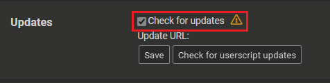

# OPFP Hider


一个用户脚本，让你可以选择性地隐藏 osu! 个人资料页面的不同部分，获得更简洁的浏览体验。

## 功能特性

- 隐藏 osu! 用户资料的特定部分：
  - Me（个人资料概览）
  - Beatmaps（谱面）
  - Recent Activity（最近活动）
  - Top Ranks（最佳成绩）
  - Medals（奖章）
  - Historical data（历史数据）
  - Kudosu
- 兼容 _**osu-web enhanced**_ 插件
- 设置在页面刷新后保持
- 每个部分都有简单的切换按钮
- 使用用户的**主题颜色**融入网页

## 安装

1. 安装用户脚本管理器，如 [Tampermonkey](https://www.tampermonkey.net/) 或 [Greasemonkey](https://www.greasespot.net/)
2. 点击安装用户脚本：
   - [Raw File Link](https://raw.githubusercontent.com/SisypheOvO/OPFPHider/main/dist/opfphider.user.js)
3. 访问任何 osu! 用户资料页面即可看到效果。然后你就配置完成了!
4. 确保在用户脚本管理器中开启自动更新以获取最新版本。

    

## 贡献

欢迎提交问题和拉取请求来改进这个脚本。

### 开发

```bash
npm i # 安装依赖
npm run build # 构建用户脚本
```

## 关于 osu-web enhanced

一个很棒的 osu 网页用户脚本。如果你感兴趣可以看看。

[release forum](https://osu.ppy.sh/community/forums/topics/1361818?n=1)

[source code on Gitlab](https://gitlab.com/RockRoller/osu-web-enhanced)

[homepage on osuck.net](https://tools.osuck.net/tool/66e9f4f78a6d5ff8a0fe5be1)
