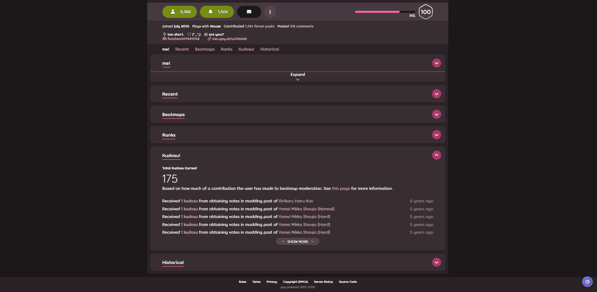
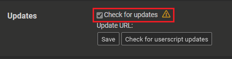

# OPFP Hider




A userscript that allows you to selectively hide different sections of osu! profile pages for a cleaner viewing experience.

> [!NOTE]
> README中文版请见 [README-zh.md](./README-zh.md)

## Features

- Hide specific sections of osu! user profiles:
  - Me (profile overview)
  - Beatmaps
  - Recent Activity
  - Top Ranks
  - Medals
  - Historical data
  - Kudosu
- Compatible with _**osu-web enhanced**_ plugin
- Persistent settings across page refreshes
- Simple toggle buttons for each section
- Blend into the webpage using the user's **theme color**

## Installation

1. Install a userscript manager like [Tampermonkey](https://www.tampermonkey.net/) or [Greasemonkey](https://www.greasespot.net/)
2. Choose one of the following links to install the userscript: (NOTE that both works the same so just pick one you like)
   - [ts compiled (recommended)](https://raw.githubusercontent.com/SisypheOvO/OPFPHider/main/dist/opfphider.user.js)
   - [js handcrafted](https://raw.githubusercontent.com/SisypheOvO/OPFPHider/main/src-js/index.user.js)
3. Visit any osu! user profile page to see it in action. You are all set then.
4. make sure to turn on AutoUpdate in your userscript manager to get the latest updates.

    

## Contributing

Feel free to submit issues and pull requests to improve the script.

### Development

```bash
npm i # install dependencies
npm run build # build the userscript
```

## About osu-web enhanced

an awesome userscript for osu webpages. check it out if you like.

[release forum](https://osu.ppy.sh/community/forums/topics/1361818?n=1)

[source code on Gitlab](https://gitlab.com/RockRoller/osu-web-enhanced)

[homepage on osuck.net](https://tools.osuck.net/tool/66e9f4f78a6d5ff8a0fe5be1)
